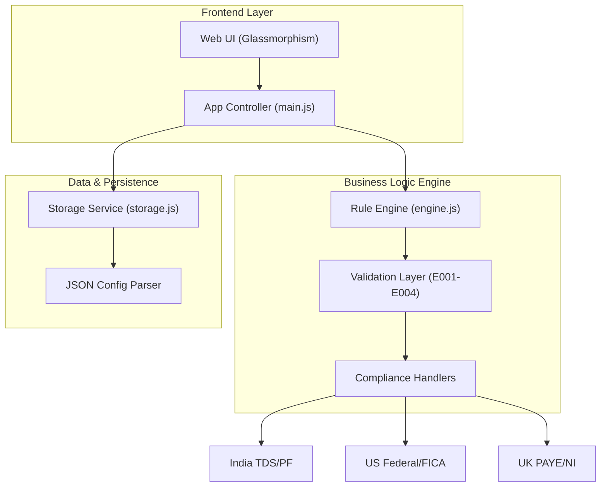

# 🏢 ProPayroll AI | Global Automation & Compliance Simulator

**ProPayroll AI** is a professional, enterprise-grade payroll orchestration platform designed to simulate complex financial workflows across global jurisdictions. It bridges the gap between raw business requirements and technical automation with a "Support-First" mindset, making it ideal for high-stakes FinTech environments.

[](https://github.com/gudapatichandana/ProPayoll-AI)
[](https://github.com/gudapatichandana/ProPayoll-AI)
[](https://github.com/gudapatichandana/ProPayoll-AI)

---

## 📖 Table of Contents
- [Project Overview](#project-overview)
- [System Architecture](#system-architecture)
- [Key Features](#key-features)
- [Enterprise Security (RBAC)](#enterprise-security-rbac)
- [Troubleshooting & Resilience](#troubleshooting--resilience)
- [Tech Stack](#tech-stack)
- [Installation](#installation)
- [Developer Perspective](#developer-perspective)

---

## 🌟 Project Overview
ProPayroll AI was developed to demonstrate **Product Thinking** in software design. It doesn't just calculate tax; it simulates an entire corporate ecosystem where data validation, role-based security, and audit trails are paramount.

### 🏗 System Architecture
The platform is built with a strictly decoupled architecture:



> [!NOTE]
> **Can't see the diagram?** [Click here to view the high-resolution Architecture Diagram](https://mermaid.ink/img/pako:eNqNUstuwjAQ_JWVpx6S_EBCpUoVByREoR6S9FA5-AAsre0idpMK8u-1Y8ghqZpLPDuzM-v1Wh8ga3MEnS_vId_S0mDscv7rEayrNoW_K56W_6U6B9qX-t0F1E2vH-6XfN9X769019XvBWh6D3_X6tOubm2vL7V-6vS5X90o6Of6UOu_9X7rdYx7B7re09-W_rT1rX6v9aPX5z6v50S0vIP4rWwB0i49y46WzXqGvU_A79T1t9O6sQfI6O3J66rW5-g-9K0_VvVp-yU48Q5irvM1pU6OVsI3V6O3Xn-2H0S23fE)

---

## 🚀 Key Features

### 🌍 Global Compliance Engine
Advanced rule-based logic for multiple regions:
- **India**: Automated TDS (10%/5% thresholds) and PF (12%) handlers.
- **USA**: Federal Withholding (22%) and FICA (7.65%) pipelines.
- **UK**: Specialized PAYE and National Insurance (NI) compliance templates.

### 📊 Data Analytics & Portability
- **SQL-Style Grid**: Real-time filtering and search for deep-dive financial analysis.
- **CSV Connectivity**: Export results directly to Excel for external auditing.
- **JSON Portability**: Import/Export system-wide configurations as structured JSON (Infrastructure as Code).

---

## 🛡 Enterprise Security (RBAC)
ProPayroll AI implements a **Role-Based Access Control** matrix to ensure data integrity:

| Role | Permissions | Focus Area |
| :--- | :--- | :--- |
| **Super Admin** | Full Read/Write/Delete | System Orchestration |
| **Support Level 1** | Simulation & Logs Only | Troubleshooting Tickets |
| **Client Auditor** | Read-only / Analytics | Compliance Verification |

---

## 🔍 Troubleshooting & Resilience
Built for high-stakes financial environments where errors are costly:
- **Granular Error Codes**: Identifies failures with specific codes (e.g., `E001: Missing Data`, `E002: Validation Failure`).
- **Simulated Backend Delay**: Mimics enterprise-grade server processing for a realistic interaction experience.
- **Mandatory Validation Layer**: Prevents processing of malformed employee metadata before it reaches the logic core.

---

## 🛠 Tech Stack
- **Core Engine**: Javascript (ES6+ Module-based architecture)
- **Build Tooling**: Vite for optimized bundling and HMR.
- **UI Design**: Custom-built **Glassmorphism CSS3 System** (zero external dependencies).
- **Persistence**: LocalStorage API with structured data serialization.

---

## 📂 Folder Structure
```text
/src
  /assets        # Premium SVG icons and background assets
  /components    # Modular UI Views (Dashboard, Analytics, etc.)
  /lib           # Core Logic: engine.js & storage.js
  main.js       # Central Application Controller
  style.css      # Enterprise Design System
```

---

## 🏃 Installation & Setup

1. **Clone the Repo**:
   ```bash
   git clone https://github.com/gudapatichandana/ProPayoll-AI.git
   ```

2. **Install Dependencies**:
   ```bash
   npm install
   ```

3. **Run Dev Environment**:
   ```bash
   npm run dev
   ```

---

## 💡 Developer Perspective (Interview Focus)
This project highlights high-level engineering skills often tested in senior recruitment:
1. **Edge Case Management**: How the app gracefully handles "Bad Data" using its internal validation suite.
2. **Security Architecture**: Enforcing separation of concerns through different user personas.
3. **Domain Expertise**: Bridging technical code with complex international tax and compliance laws.

---

**Designed & Developed for High-Level Financial Placements.**
